# MCIF-AFD2--AndroidApps <!-- omit in toc -->
MCIF-AFD2 Run Android Apps in Android Studio emulator for forensic analysis
# Table of Contents <!-- omit in toc -->
- [Exercise](#exercise)
  - [1. Install required tools](#1-install-required-tools)
  - [2. Configure emulator](#2-configure-emulator)
  - [3. Android apps and its files](#3-android-apps-and-its-files)
    - [3.1 Install apps](#31-install-apps)
    - [3.2 Important directories](#32-important-directories)
    - [3.3 Extract data](#33-extract-data)

# Exercise
The goal of this exercise is to run an app inside the Android Studio emulator on **Windows OS** and then collect the files generated by that app.

> **_NOTES TO WINDOWS USERS_**
> 
> - The emulator installed with Android Studio requires the Intel [Hardware Accelerated Execution Manager (HAXM)](https://github.com/intel/haxm) drivers. However, HAXM is **not** compatible with the "Windows Hypervisor Platform";
> - The "Windows Subsystem for Linux (WSL)" requires the "Windows Hypervisor Platform (WHP)" to work. Therefore, it is **not** possible to have both the WSL and the HAXM drivers running at the same time;
> - If you want/need to have an Android emulator and WSL at the same time, you can try the Visual Studio instead of Android Studio. [Visual Studio](https://docs.microsoft.com/en-us/xamarin/android/get-started/installation/android-emulator/hardware-acceleration?pivots=windows) + [Xamarin](https://docs.microsoft.com/en-us/xamarin/get-started/installation/windows) provides an IDE with support for running Android emulator with **Hyper-V** instead of HAXM (we didn't test this solution).


> **_NOTES TO LINUX USERS_**
> 
> - Appart from the installation process, the steps to set up Android Studio on Linux are the same (sections 2. and 3.).
> - If you want to try the Android emulator **without** the Android Studio GUI (to save resources), you can try this [tutorial](https://github.com/labcif/Android4QEMU).

## 1. Install required tools

Download and install the following tool:
- [Android Studio](https://developer.android.com/studio)


> **_NOTE_**
>
> If you need to disable the "Windows Hypervisor Platform" type "Turn Windows features on or of" in the Windows search bar, then **disable** the feature from the menu by removing the check mark:
> 
> 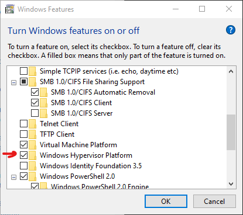
> 
> Then restart your computer (this is mandatory) and follow the installation steps bellow.
> 
> If you already installed Android Studio and need to install the HAXM drivers, run: `%LOCALAPPDATA%\Android\Sdk\extras\intel\Hardware_Accelerated_Execution_Manager\intelhaxm-android.exe`


To install Android Studio, follow thess steps:

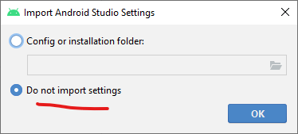

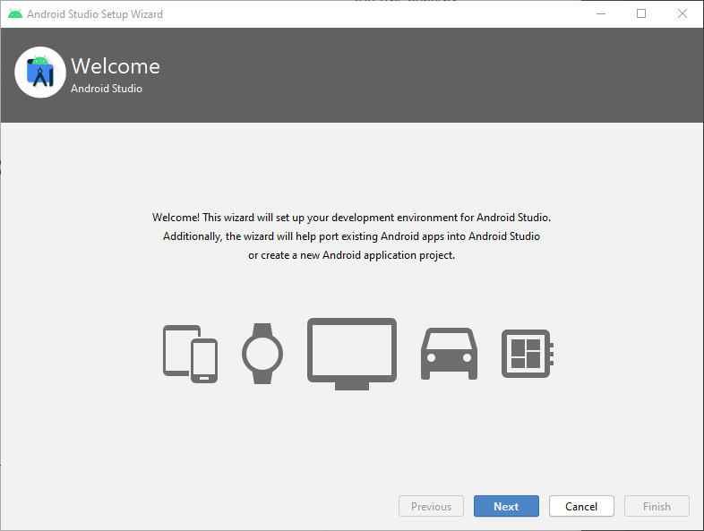

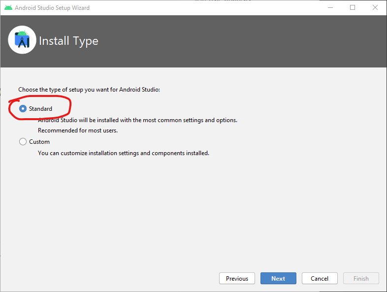


## 2. Configure emulator
Once the Android Studio is installed, we need to create and configure an Android Virtual Device (AVD).

1. Open Android Studio and choose `Create New Project`:
    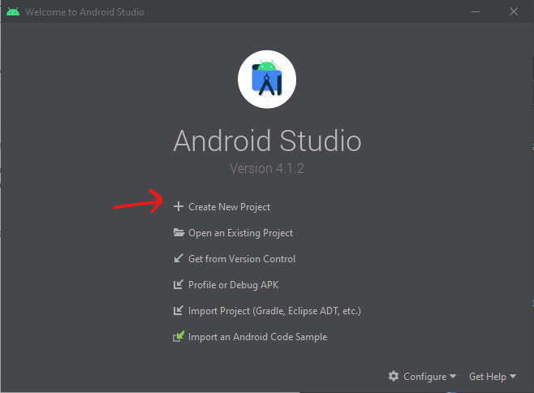

2. In the `Project Template` window select `No Activity`, and then `Next`:
    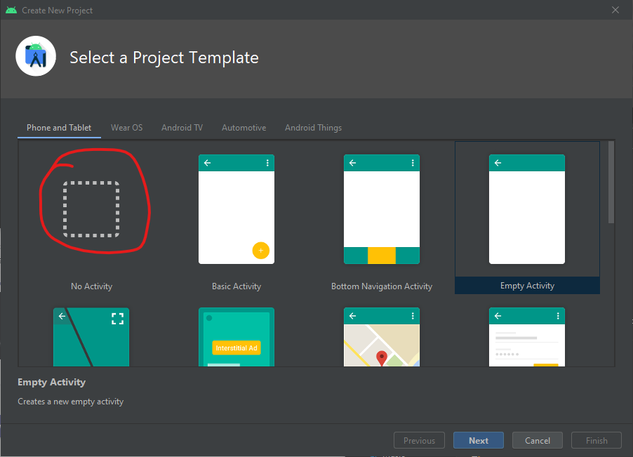

3. On the `Configure Your Project` give a name to it, like `MCIF-AFD2`, and click `Finish`:
    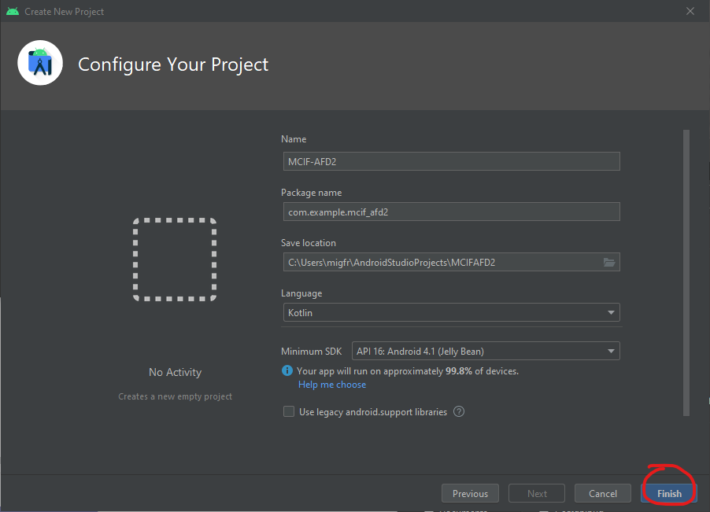

4. The Android Studio IDE should be open now. Go to `Tools → AVD Manager`:
    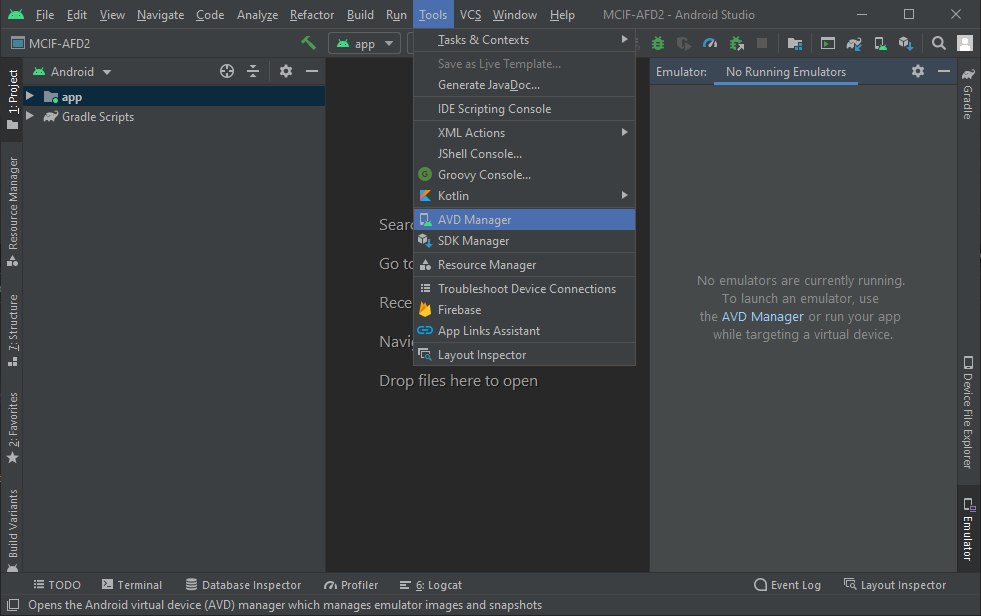

5. In the `Virtual Devices` window, click `Create Virtual Device...`:
    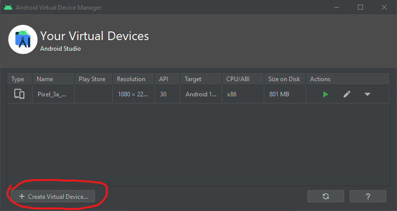

6. In the `Select Hardware` window, click `New Hardware Profile`:
    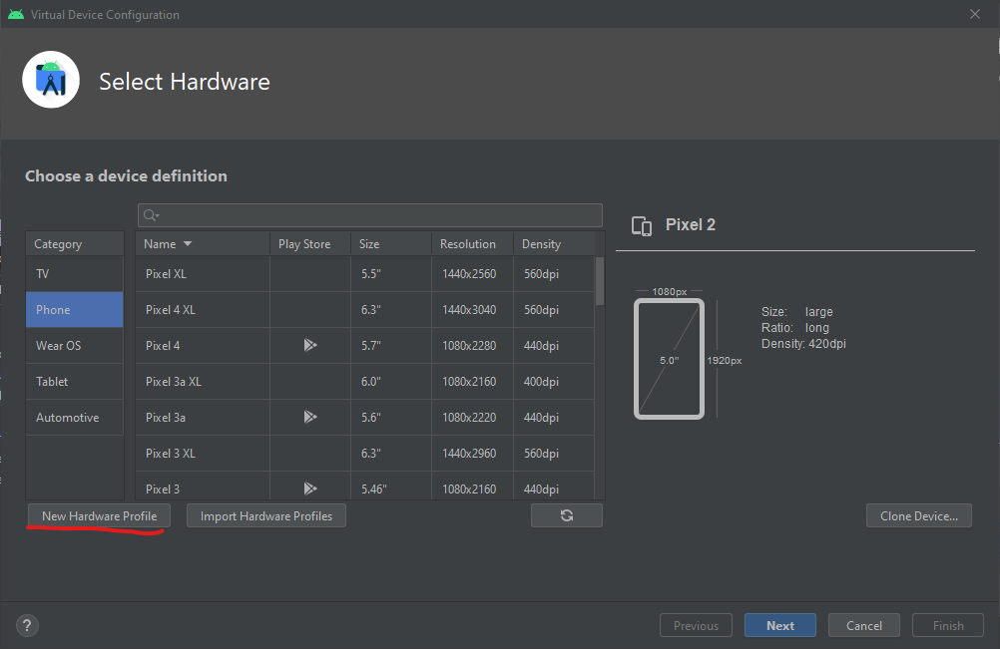

7. A new windows will open, the `Configure Hardware Profile`:
  - give a name to the device
  - chose a resolution (the lower the resolution the better the emulator performance will be), we recommend `320x640`
  - activate both `Has Hardware` check boxes
  - then click `Finish`
  
    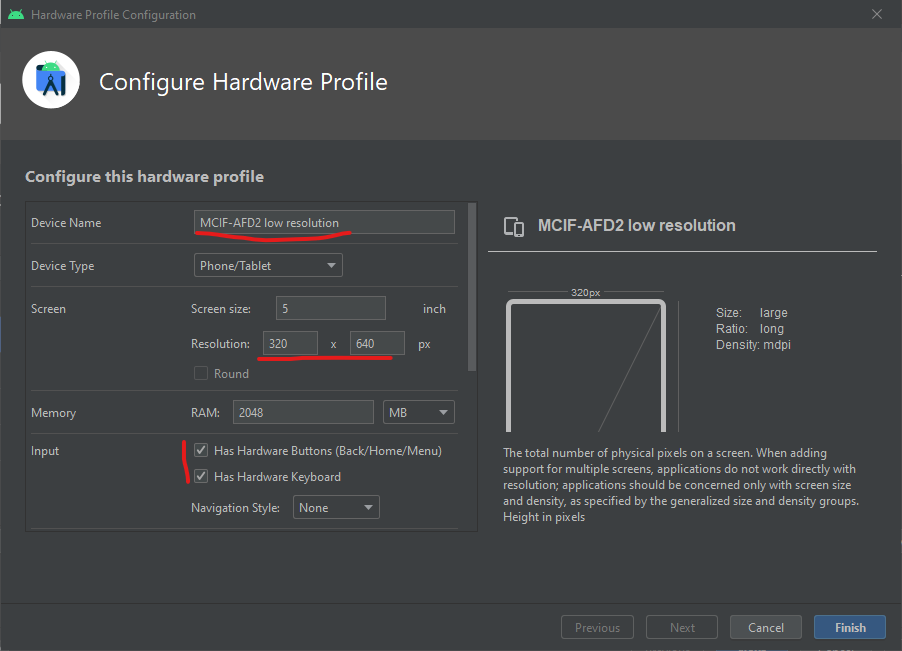

8.  In the `System Image` window select the latest recommended release, then `Next`:
    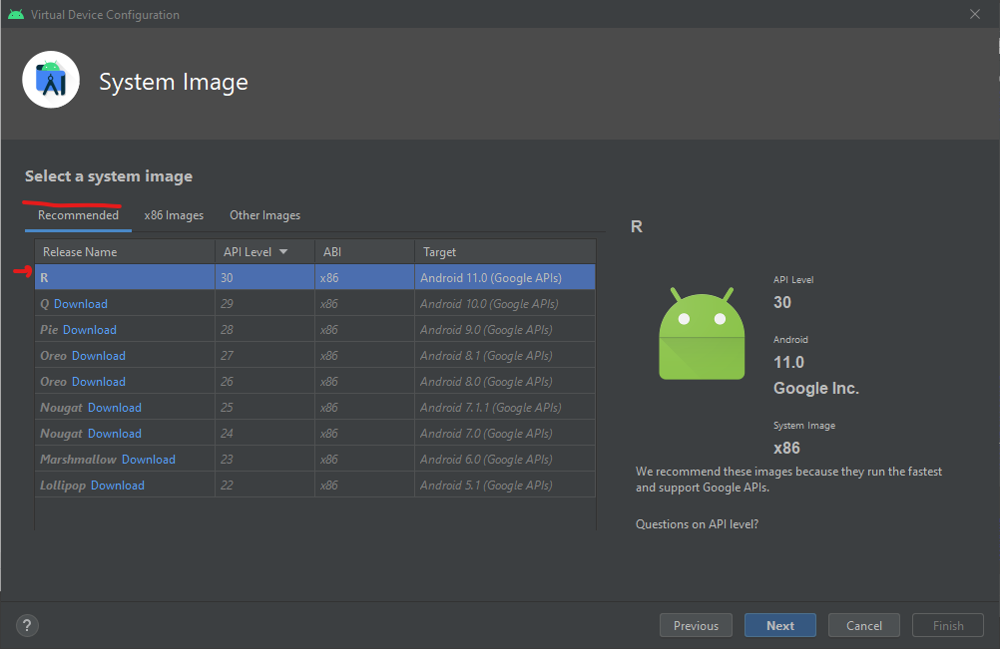

> **_NOTE_** 
> 
> We need root access to the folders inside the emulator, therefore we **cannot select** a system-image with `_playstore` name, or symbol.

9.  Now, in the `Android Virtual Device (AVD)` verify the configuration and click `Finish`:
    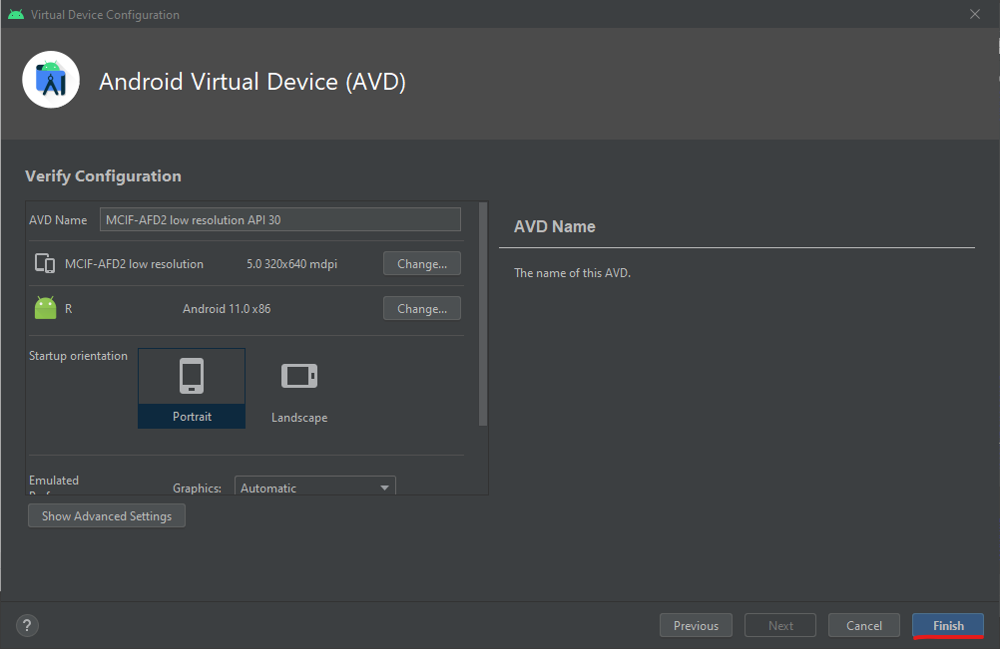

10. The newly created AVD should now be listed in the `Your Virtual Devices`. Select it and click `run` (triangle under the `Actions` column):
    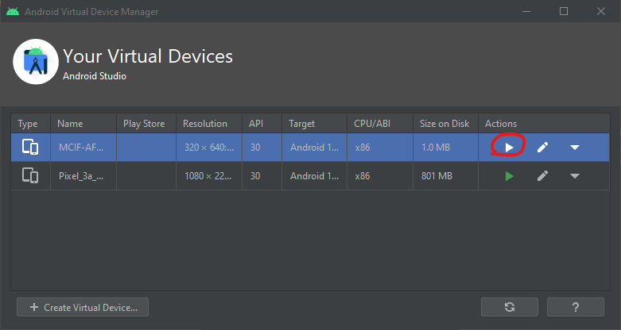

11. If everything goes ok, you should be able to see the emulator window. Notice the buttons `Power`, `Back`, `Home` and `Overview` on top of the window. Interact with the emulated Android to confirm that everything is working.

    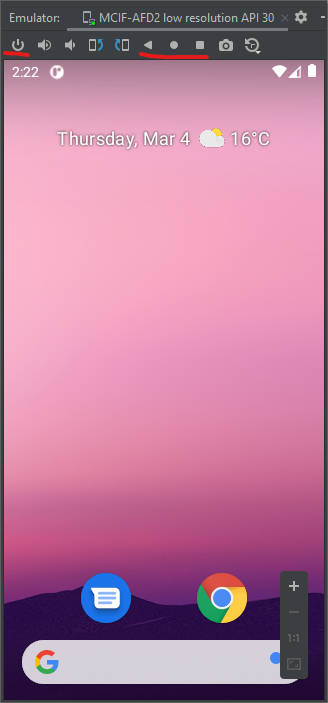
   

## 3. Android apps and its files
This sections shows how to install apps inside the Android emulator and also how to get the files produced by those apps to later perform a digital forensics analysis.

### 3.1 Install apps

A system-image without `_playstore` won't have access to the Google Play Store. So, to install apps you need to go to a website and download the `APK` file of the apps we want to install.

Go to https://www.apkmirror.com/ and download the latest versions of following apps:
- Google Authenticator
- Termux

> **_NOTE_** 
> 
> The `>` represents the command prompt and **must not be typed**

Save the files in the directory `C:\apk`, open a command line (`cmd.exe`) and type:
```
> cd %LOCALAPPDATA%\Android\Sdk\platform-tools
```

Now, use the `adb` commands to connect to the emulator and install the desired apps (repalace `<app-filename>` with the actual filenames):
```
> adb devices
List of devices attached
emulator-5554   device

> adb install \apk\<app-filename>.apk
Success
```

Once the apps are installed we can interact with then to generate some data.

Open `Google Authenticator` and click the `+`, then choose `Insert key`, type the name `Test` in the account name,  in the key filed type `asdfghjklqwertyuiop` and click `Add`. If this operation is successful you should see a 6 digit OTP number.

### 3.2 Important directories
Once the apps are installed we can inspect the data they generate in two different places:
- public data directory
- private data directory

Next, is a description of each of them.

**Public data** -- data that is available even on non-rooted devices:
```
> adb shell
generic_x86_64_arm64:/ $ cd /storage/emulated/0/Android/data/<app dir>
```

However, there are 4 links that can be used as alternative paths to `/storage/emulated/0/` and, therefore, to reach the public data dir:

```
/
├── sdcard/ → /storage/self/primary/
├── mnt/
│   ├── sdcard/ → /storage/self/primary/
│   └── user/0/primary/ → /storage/emulated/0/
└── storage/
    ├── self/primary/ → /mnt/user/0/primary/
    └── emulated/0/Android/data/
```

So, you can use also a shorter path:
```
> adb shell
generic_x86_64_arm64:/ $ cd /sdcard/Android/data/<app dir>
```

**Private data** -- data that is only available with root (notice the change from `$` to `#` in the prompt):
```
> adb shell
generic_x86_64_arm64:/ $ su
generic_x86_64_arm64:/ # cd /data/data/<app dir>
```

### 3.3 Extract data

1. Connect to the Android emulator and follow the steps bellow to create a `tgz` file with the contents of the private directory af an app:
```
> adb shell
generic_x86_64_arm64:/ $ su
generic_x86_64_arm64:/ # cd /data/data/
generic_x86_64_arm64:/ # tar -cvzf /sdcard/Download/<compressed-filename>.tgz <app folder>/
generic_x86_64_arm64:/ # exit
generic_x86_64_arm64:/ $ exit
```
> ***_NOTE_*** 
> 
> Don't copy the individual files directly to your computer with `adb pull` command, specially if you're using Windows, because you might loose information:
> - for example, the files `file.txt` and `File.txt` are two different files under Linux (Android uses a Linux kernel) but are the same file under Windows
> - Windows doesn't recognizes Linux's links
> - there are some characters that are allowed in Linux file names, but that aren't supported on Windows


2. Copy the `tgz` file into your computer for analysis
```
> adb pull /sdcard/Download/<compressed-filename>.tgz \apk
/sdcard/Download/<compressed-filename>.tgz: 1 file pulled. 0.1 MB/s (180 bytes in 0.010s)
```
3. Decompress the file with `7z`, or other tool that supports `.tgz` files, and start the analysis

