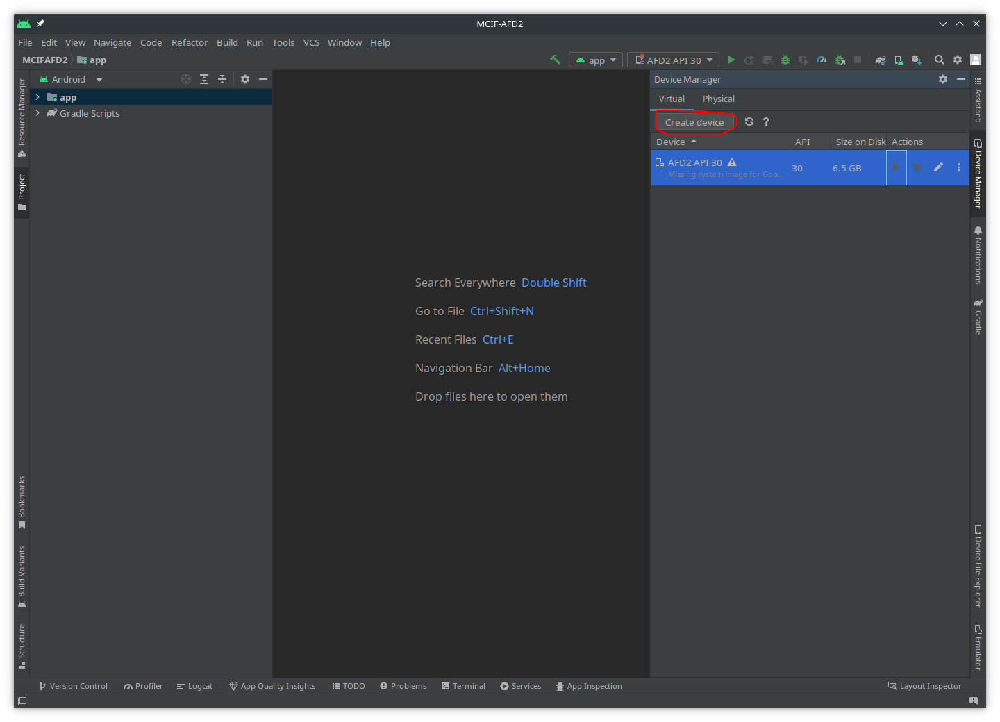
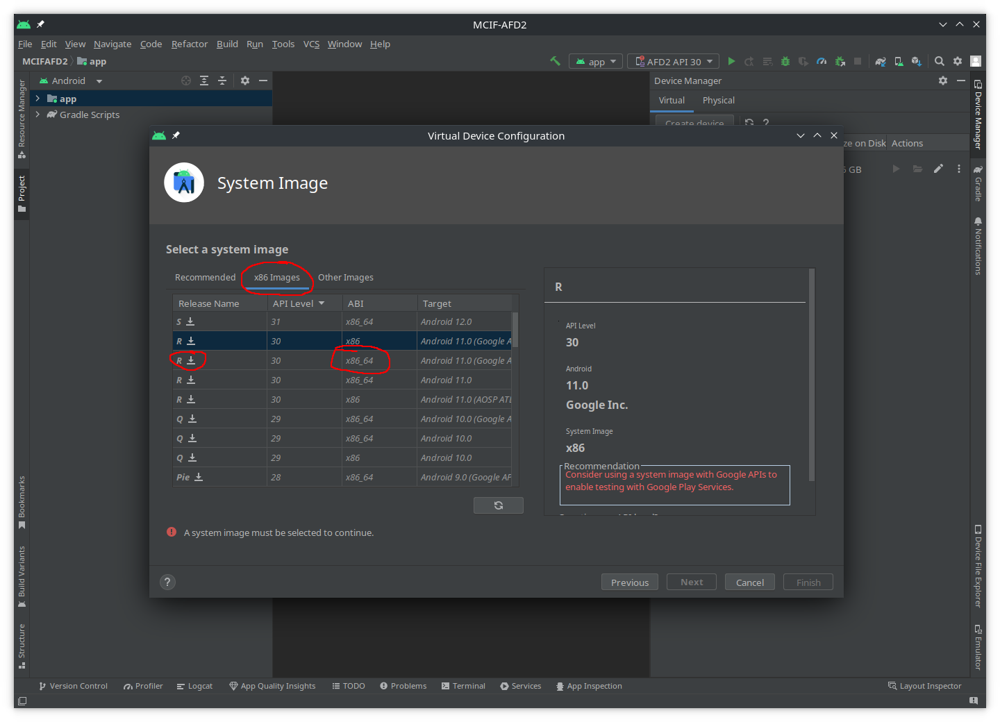

# AndroidStudioEmulator-GUIconfig <!-- omit in toc -->

The goal of this tutorial is to install Android Studio to run apps.

|         |           |
| :-:     | :--       |
|  | This work is licensed under a [Creative Commons Attribution-NonCommercial-ShareAlike 4.0 International License](http://creativecommons.org/licenses/by-nc-sa/4.0/) |

## Table of Contents <!-- omit in toc -->
- [1. Install required tools](#1-install-required-tools)
- [2. Configure emulator](#2-configure-emulator)
- [3. Exercise](#3-exercise)

## 1. Install required tools

> **_NOTES TO LINUX USERS_**
> 
> - This tutorial was created with Windows OS in mind. However, appart from the installation process, the steps to set up Android Studio on Linux are the same (sections 2. and 3.).
> - If you want to try the Android Studio Emulator **without** the GUI (to save resources), you can try this [tutorial](https://labcif.github.io/AndroidStudioEmulator-cmdConfig/).

> **_NOTES TO WINDOWS USERS_**
>  
> - The emulator installed with Android Studio requires the Intel [Hardware Accelerated Execution Manager (HAXM)](https://github.com/intel/haxm) drivers to speed up the emulator. However, HAXM is **not** compatible with the "Windows Hypervisor Platform";
> - The "Windows Subsystem for Linux (WSL)" requires the "Windows Hypervisor Platform (WHP)" to work. Therefore, it is **not** possible to have both the WSL and the HAXM drivers running at the same time;
> - If you want/need to have an Android emulator and WSL at the same time, you can try the Visual Studio instead of Android Studio. [Visual Studio](https://docs.microsoft.com/en-us/xamarin/android/get-started/installation/android-emulator/hardware-acceleration?pivots=windows) + [Xamarin](https://docs.microsoft.com/en-us/xamarin/get-started/installation/windows) provides an IDE with support for running Android emulator with **Hyper-V** instead of HAXM (we didn't test this solution).
> - HAXM drivers are not compatible with AMD CPUs, but it's still possible to run Android Studion Emulator in AMD processors.

Download and install the following tool:

- [Android Studio](https://developer.android.com/studio)

> **_NOTE_**
>
> If you need to disable the "Windows Hypervisor Platform" type "Turn Windows features on or of" in the Windows search bar, then **disable** the feature from the menu by removing the check mark:
>
> 
> 
> Then restart your computer (this is mandatory) and follow the installation steps bellow.
> 
> If you already installed Android Studio and need to install the HAXM drivers, run: `%LOCALAPPDATA%\Android\Sdk\extras\intel\Hardware_Accelerated_Execution_Manager\intelhaxm-android.exe`

To install Android Studio, follow thess steps:
- Step 1: 

- Step 2 

- Step 3:

- Step 4:

- Step 5:

- Step 6:

- Step 7:
	- Also check [Configure hardware acceleration for the Android Emulator](https://developer.android.com/studio/run/emulator-acceleration?utm_source=android-studio), and for Ubuntu Linux also check [KVM installation](https://help.ubuntu.com/community/KVM)

- Step 8:

## 2. Configure emulator

Once the Android Studio is installed, we need to create and configure an Android Virtual Device (AVD).

1. Open Android Studio and choose `New Project`:
    

2. In the `New Project` window select `No Activity`, and then `Next`:
    

3. On the `Configure Your Project` give a name to it, like `MCIF-AFD2`, and click `Finish`:
    
	- Wait for the installation of the packages, then press `Finish`.

4. The Android Studio IDE should be open now. Go to `Tools → Device Manager`:
    

5. In the `Device Manager` sub-window, click `Create Device`:
    

6. In the `Select Hardware` window, click `New Hardware Profile`:
    

7. A new windows will open, the `Configure Hardware Profile`:
	- give a name to the device, e.g. `AFD2 Low resolution`
	- chose a resolution (the lower the resolution the better the emulator performance will be), we recommend `320x640`
	- activate both `Input` check boxes (`Has Hardware ...`)
	- then click `Finish`
    

	- Verify that the new devices exists, then press `Next`
		

8. In the `System Image` window select `x86 Images`, then select `API Level = 30` (we don't want the latest version because it'll have more security features that make it harder for us to analyse apps) with `ABI = x86_64` . Finaly click the down arrow next to the `R` letter to download the emulator files:

> **_NOTE_**
>
> We need root access to the folders inside the emulator, therefore we **cannot select** a system-image with `_playstore` name, or symbol.

    
	- Then click `Finish`, and `Next`)

9. Now, in the `Android Virtual Device (AVD)` verify the configuration and click `Finish`:
	

10. The newly created AVD should now be listed in the `Devices`. Select it and click `run` (triangle under the `Actions` column):
	
	- You may detach the `Devices` window:
	

11. If everything goes ok, you should be able to see the emulator window. Notice the buttons `Power`, `Back`, `Home` and `Overview` on top of the window. Interact with the emulated Android to confirm that everything is working.
	

## 3. Exercise

After setting up the Android Studio Emulator and making sure it's working, do the [exercise listed here](https://labcif-tutorials.github.io/AndroidStudioEmulator-acquireAppsData/)
